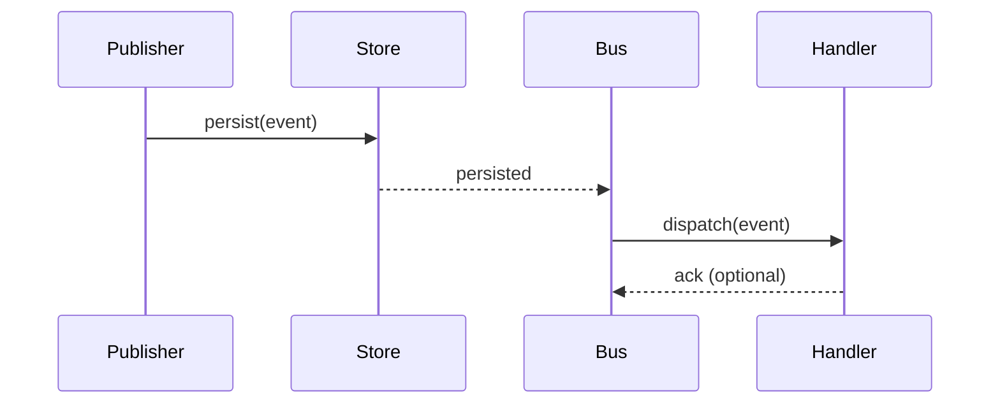

# Event Bus Architecture — TrainArduino

**Overview**

This document describes the centralized Event Bus introduced in `lib/events`.
It provides a strongly-typed, in-memory Event Bus that domains can use to publish and subscribe to domain events. The implementation is intentionally adapter-friendly so it can be replaced with Redis Streams, Kafka, or other durable/eventing backends later.

**Files added**

- `lib/events/types.ts` — core event types and helper types.
- `lib/events/eventStore.ts` — in-memory append-only event store.
- `lib/events/registry.ts` — registry for event metadata (name, version, description).
- `lib/events/eventBus.ts` — central coordinator wiring store, registry, and subscription dispatch.
- `lib/events/publisher.ts` — `EventPublisher` API: `publish()`, `publishMany()`.
- `lib/events/subscriber.ts` — `EventSubscriber` API: `subscribe()`, `unsubscribe()`.

**Architecture**

- EventPublisher persists events to the EventStore before notifying subscribers.
- Subscribers receive events after they are durable in the store.
- Registry maintains allowed event names and versions; registering new events is optional but recommended.
- The EventStore offers `persist`, `persistMany`, `load`, and `replay` primitives.

**Lifecycle**

1. A domain composes an `EventEnvelope` with required fields: `id`, `name`, `version`, `timestamp`, `source`, `userId?`, `correlationId?`, `payload`, `metadata?`.
2. The `EventPublisher.publish()` call persists the event and returns.
3. The `EventBus` notifies subscribers for that event name (fire-and-forget for handlers).
4. Subscribers process events and may emit new events in reaction.

**Publishing rules**

- Publishers should include `correlationId` when triggering multi-step workflows.
- Events are persisted to the EventStore synchronously (in-memory) before subscribers are notified.
- Publishers should not assume subscribers have completed; handlers may run asynchronously.

**Subscription rules**

- Subscribe to specific event names only.
- Handlers must be idempotent and resilient (retries, dedupe) because future distributed transports may deliver at-least-once.
- Handlers should catch and surface errors; the EventBus swallows handler errors by default to avoid blocking the publisher.

**Error handling**

- Persistence errors bubble to the publisher.
- Subscriber errors are caught and ignored by the in-memory bus. Implementations using durable transports should implement retry and DLQ strategies.

**Future distributed implementation**

- Replace `InMemoryEventStore` with `RedisStreamEventStore` or `KafkaEventStore` implementing the same API: `persist()`, `persistMany()`, `load()`, `replay()`.
- Move dispatching to an external worker or consumer group to guarantee delivery order and retries.
- Implement a small dispatcher that acknowledges messages only after subscribers succeed (or send to DLQ).

**Diagrams**

```mermaid
flowchart LR
  A[Domain: Publisher] -->|1. publish()| B[EventPublisher]
  B -->|2. persist| C[EventStore (in-memory / redis / kafka)]
  C -->|3. emit| D[EventBus Dispatcher]
  D -->|4a. notify| E[Subscriber A]
  D -->|4b. notify| F[Subscriber B]
  E -->|may publish| B
  F -->|may publish| B
```



**Recommendations for domains**

- Start using `lib/events/publisher.ts` and `lib/events/subscriber.ts` for cross-domain communications.
- Keep payloads small and versioned. Prefer references (ids) instead of large embedded objects.
- Register event names in the registry during app startup for observability.

**Compatibility**

- No breaking changes introduced. The API is additive and coexists with direct function calls. Migrate domains gradually.

**Next steps**

- Add a Redis-backed store for production durability.
- Build a replay/consumer service to rehydrate projections from stored events.
- Add automated tests for event ordering and replay semantics.
